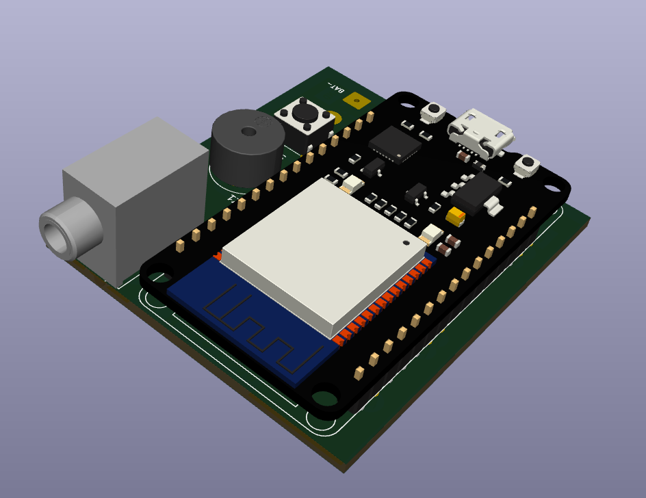
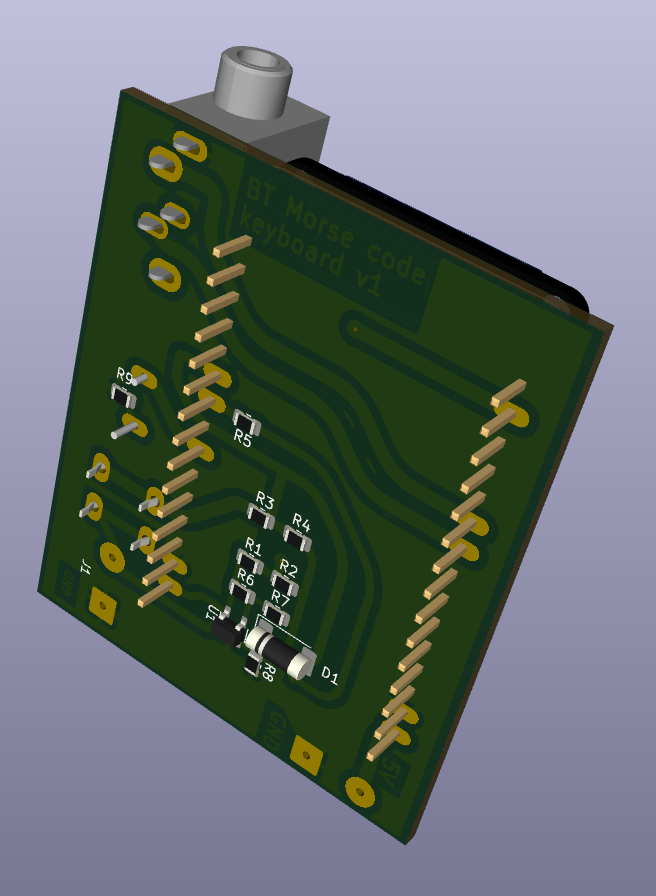

# Morse Code Keyer BLE

## Overview
This project is a Bluetooth keyboard for a Morse Code keyer. 

Main purpose is to practice morse code in the Morse Mania iOS app with a real morse code key.

Data flow looks like this

a CW Keyer -over audio-wire-> this BT Keyboard box --over BT-> iPhone

The Morse Mania app expect "[" and "]" buttons, so this Bluetooth keyboard sends key_down and key_up events.

<b>Notice: </b>
if you have more than one language installed, you must switch to "English" before this BT keyboard connects. If you don't the Morse Mania app would be gettting whatever your national symbols are mapped to the "[" and "]" buttons on the standard keyboard and the app would looks broken.

## Features
- BLE keyboard functionality
- Tone generation for startup and shutdown
- Voltage detection to monitor battery status, audio bips when voltage is below ~2.9V
- Inactivity 5min auto turn-off

## Usage
- Connect the Arduino to your computer and upload the code.
- Open a BLE-capable device and connect to the "Morse Code Keyer".
- Use the iambic CW paddles to send Morse code.

## Assembly

See schematic and PCB in the  "kicad" folder.
The firmware in the "firmware" folder.

[See interactive PCB 3d view here](https://3dviewer.net/#model=https://github.com/ikatkov/cw-key-ble-keyboard/main/pcb.wrl)

## Acknowledgments
- [Arduino](https://www.arduino.cc/)
- [BleKeyboard Library](https://github.com/Teckel12/BLEKeyboard)